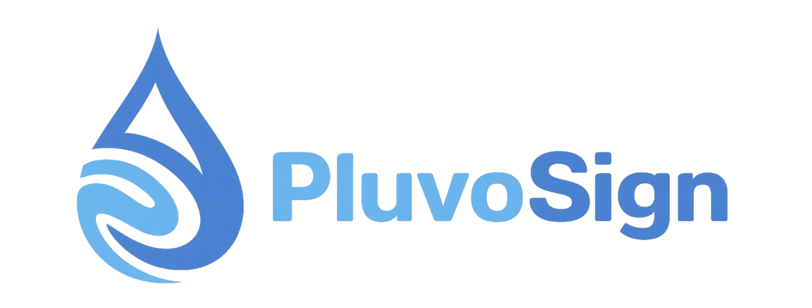

<h1 align="center">
  
</h1>

**Self-hosted electronic signature platform** — send documents for signature,
sign them, and produce legally valid signed PDFs with a completion certificate.

A service by [Pluvo](https://pluvoai.com)

---

## About

Pluvo Sign is a private, self-hosted e-signature platform. Each deployment runs
on its **own dedicated server** — no per-user fees, no document limits, full
data ownership.

It is built on [OpenSign](https://github.com/OpenSignLabs/OpenSign), an
open-source e-signature project, and is distributed under the same licence
(AGPL-3.0). Pluvo's product is the **service** — deployment, branding, hosting
and ongoing maintenance — not the software itself.

## Features

- Secure PDF e-signing — hand-drawn, typed, uploaded or saved signatures
- Multiple signers, enforced signing order, and sign-by-link
- Email one-time-code (OTP) verification for guest signers
- Reusable document templates
- Expiring documents and signer rejection with a reason
- Full audit trail and a completion certificate on every finished document
- Customisable email templates
- REST API

## Stack

React (Vite) frontend · Node / Parse Server backend · MongoDB · Caddy reverse
proxy — all in Docker. The stack is defined in `docker-compose.yml` and
`Caddyfile`, configured through environment variables.

## Deployment

Pluvo Sign deployments are provisioned and maintained by Pluvo. Each client gets
a dedicated instance on their own server, branded to them.

## Licence

Pluvo Sign is licensed under the **GNU Affero General Public License v3.0** —
see [LICENSE](LICENSE). As required by the AGPL, the source of the deployed
version is published in this repository.

Content under `apps/OpenSignServer/cloud/customRoute` is governed by the terms
stated in the root `LICENSE` file.

## Acknowledgements

Pluvo Sign is a fork of [OpenSign](https://github.com/OpenSignLabs/OpenSign) by
OpenSignLabs. Our thanks to the OpenSign project and its contributors.

---

© Pluvo · [pluvoai.com](https://pluvoai.com)

